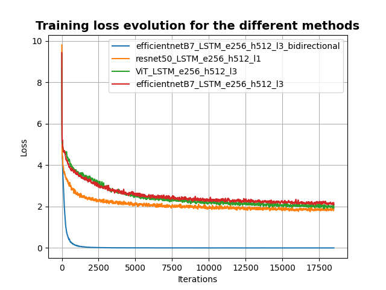
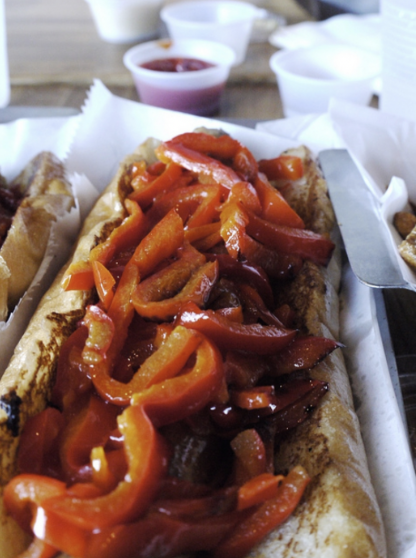
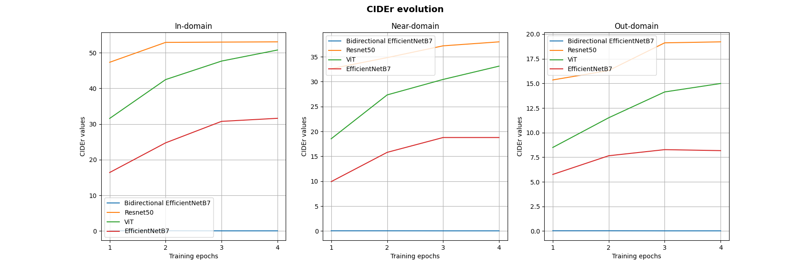
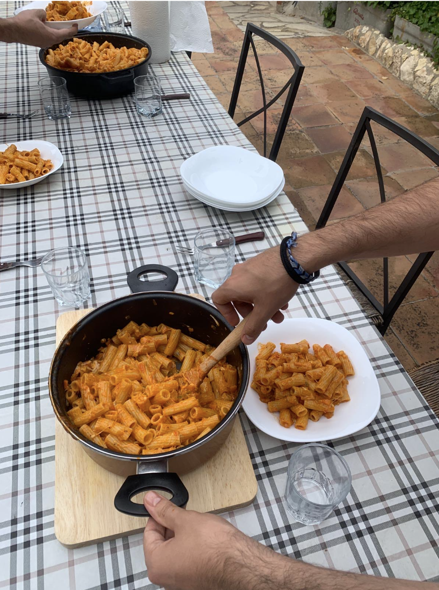
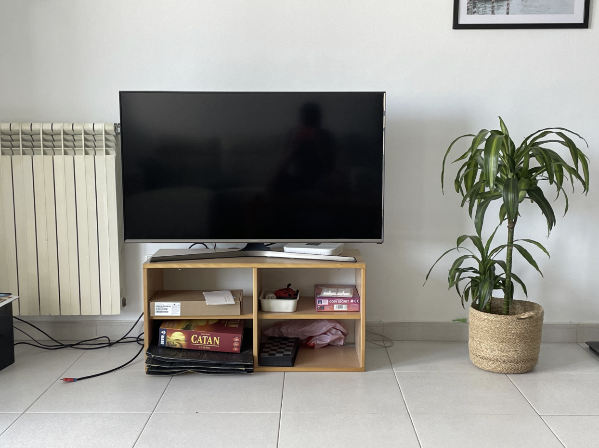
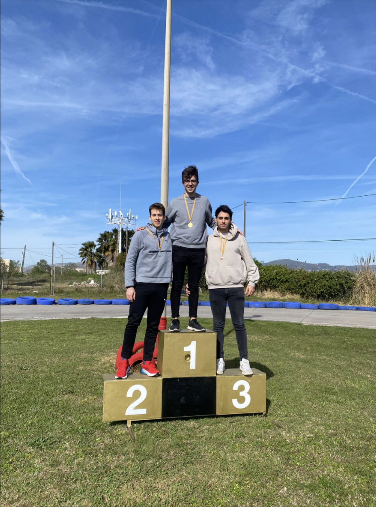

# Image2Text-UPF

The goal of this project is to understand how image captioning models work, implement some architectures to perform image captioning and experiment with some well known frameworks to test the performance of the resulting models.

## 1. Introduction to image captioning

Image captining consists on generating a textual description of an input image. Typical deep learing (DL) architectures that aim to solve this task are divided into two main components:
- An **encoder**, which is in charge of extracting the relevant features of the input image.
- A **decoder**, which uses the extracted features to build the final sentence describing the original image.

Prior to generating the final text output, the model has to face other intrinsic challenges such as object detection and object recognition.

The most basic architectures use a CNN-RNN approach. However, more recent and complex architectures have been proven to have impressive results. This is the case of [attention-based methods](https://openaccess.thecvf.com/content_cvpr_2018/papers/Anderson_Bottom-Up_and_Top-Down_CVPR_2018_paper.pdf) or methods using [transformers](https://arxiv.org/pdf/2205.14100.pdf)


## 2. Dataset

To train our models, we have used the [COCO (Common Objects in Context)](https://cocodataset.org/#home). This is a well known benchmark dataset for object detection, segmentation and image captioning. More precisely, we have used the 2017 version which is divided into three different splits:
1. Training split: ~118K images (18 GB)
2. Validation split: ~5K images (1 GB)
3. Testing split: ~41K images (6 GB)


Each of the images for the training and validation split come with 5 different captions.

| Images                                   | Captions                                                     |
| ---------------------------------------- | ------------------------------------------------------------ |
| </img> | **1:** black and white image of a man in a livingroom with a cluttered floor.<br />**2:** a man standing in a room with items scattered on the floor.<br />**3:** a man standing in a living room next to a couch.<br />**4:** man standing in the middle of his living room looking over a mess of spilled items.<br />**5:** a black and white photo of a man standing in a bay window |
| </img>       | **1:** a pizza with a lot of veggies on it sitting on a table.<br />**2:** a pizza is being prepared on a table.<br />**3:** a pizza is on a plate of tin foil.<br />**4:** a pizza sitting outside on a table on apiece of foil.<br />**5:** large unbaked pizza on table in outdoor setting. |
| </img>       | **1:** stuffed animal marionette puppets for sali in a shop.<br />**2:** a family of stuffed animals sitting inside of a store.<br />**3:** a display of stuffed animals is in a store.<br />**4:** a rack with various types of marionette puppets hanging.<br />**5:** multi-colored stuffed animals standing side by side in a shop |

The COCO dataset can be easily handled through the [COCO API](https://github.com/cocodataset/cocoapi/blob/master/PythonAPI/pycocotools/coco.py). All the images of the dataset can be retrieved from their url, without the need of having the dataset locally downloaded. Nevertheless, we highly recommend to [download](https://cocodataset.org/#download) each of the splits on your computer to avoid further problems that will be explained later.
> We can not guarantee that the code for this project directly works if the dataset is not downloaded.


## 3. Preprocessing the data

In our previous lab session we decided to buy a Colab Pro license in order to have more computing power for the two remaining labs and this project. We first uploaded all the images and annotations of the COCO dataset to Google Drive in order to make them accessible from the notebook. Once this was done, we started executing our previously tested code in the Colab GPUs. Unfortunately, due to the large amount of images that the folder had, we were not even able to load an image to the notebook. Therefore, we had to move to local computing gain. Luckily, one of us had a GPU so we could speed up significantly the computations.

When training the first architectures, we realized that loading the images from the files and applying the transformations each timw was also a slow process. For this reason, and as we had to train several architectures, we decided to save all the transformed images directly as tensors by using `tensor.save()` to then load them using `torch.load()`. By doing this we improved noticeably the performance and we removed the training bottleneck (loading and transforming the images).

In the end, your directory structure should be the following:

```code
Image2Text-UPF
├── assets
├── clean_data
│   ├── nocaps
│   ├── train2017
│   └── val2017
├── data
│   ├── cocoapi
│   │   ├── annotations
│   │   └── images
│   └── nocaps
│       └── images
├── logs
├── models
│   ├── efficientnetB7_LSTM_e256_h512_l3
│   ├── efficientnetB7_LSTM_e256_h512_l3_bidirectional
│   ├── resnet50_LSTM_e256_h512_l1
│   ├── resnet50_LSTM_e256_h512_l3
│   └── ViT_LSTM_e256_h512_l3
├── nocap_metrics
│   ├── efficientnetB7_LSTM_e256_h512_l3
│   ├── efficientnetB7_LSTM_e256_h512_l3_bidirectional
│   ├── resnet50_LSTM_e256_h512_l1
│   └── ViT_LSTM_e256_h512_l3
├── predictions
│   ├── efficientnetB7_LSTM_e256_h512_l3
│   ├── efficientnetB7_LSTM_e256_h512_l3_bidirectional
│   ├── resnet50_LSTM_e256_h512_l1
│   └── ViT_LSTM_e256_h512_l3
└── src
```

* `clean_data` contains all the images converted to tensors, both from COCO and nocaps apart from the nocaps `.json` file
* `data` contains all coco images and annotations
* `models` contains all the checkpoints of our trained models
* `predictions` contains the inference results of our best model in nocaps format.
* `src` contains all the source code 

## 4. Initial idea : ViT & GPT2

When we started by gathering information about the state of the art models that were performing better in image captioning we were highly surprised by the results that they manage to obtain. However, these have complex architectures that we considered to be out of the scope of the project, due to lack of time and advanced knowledge. 

While we were looking for less complex but still performant models, we came across with `ViT + GPT2`. This model combines two different kind of transformers, **visual transformers** for extracting the features of the image (ViT encoder), and the **usual transformers** used by [GPT2](https://huggingface.co/gpt2) in order to generate the captions.

Our first approach was to try to combine pre-trained `ViT` and `GPT2` to generate captions. Unfortunately, there was little information about how these were combined and specificallly about how to implement the visual transformer in pytorch. Despite this, we considered that keeping GPT2 as the decoder would provide good results, so kept it but changed the image encoder.

## 5. VGG & GPT2

[`VGG`](https://arxiv.org/pdf/1409.1556.pdf) was a well known architecture by us, since we had previously worked with simple versions of it in the lab sessions. Therefore, we thought it was a good starting point to use it for extracting the image features. The models used in this architecture were `VGG16` and `GPT2-Small`. 

In order to join them to have the final "encoder-decoder" architecture we had to do two main modifications.

### Adjusting VGG output size

The image features extracted by VGG were used as the first input token of GPT2. Therefore, we had to make the output size of the decoder match the **embedding dimensionality** of GPT2. First, we found that the dimensionality of the embeddings of `GPT2-Small` was $768$. Therefore, we added a fully-connected layer to the output of VGG that took as input the linearized output of VGG, having the following dimensionality change $25088 \to 768$. 

### Adding padding to compute the loss

Once our model started training, we realized that the target caption and the output of the model did not had the same size. Therefore, we had to make them match in order to compute correctly the losses. The approach we took was to add padding to the shortest tokenized caption.

### Results

After training the model for some time we realized that the loss was too high, so we would not be able to make the model learn in a feasible amount of time. Furthermore, the modifications mentioned above could make the model struggle even more in the learning process. Therefore, we decided to move on with a already performant architecture.

## 6. CNN & RNN

These types of architectures are the most simple ones and can be used as a starting point to get introduced into image captioning. The CNN is used as en encoder to extract the image features, and the RNN acts as a decoder, by generating the caption from the feature map. For this part,  we used an already existing [github project](https://github.com/iamirmasoud/image_captioning) as template, from which we could start doing different experiments.

We have tried different pre-trained encoder architectures, for which we have re-trained some of their layers, and experimented with simple RNN decoders, which we have fully trained.

### Resnet50 with a simple RNN

**ResNet-50** is a deep convolutional neural network architecture which comes from the [ResNet](https://arxiv.org/pdf/1512.03385.pdf) family of models. It is designed to address the problem of vanishing gradients in very deep neural networks due to the use of residual connections. It is a very good baseline model to perform image classification and object detection as it has been trained with the [ImageNet](https://www.image-net.org/index.php) dataset. Therefore, we believed that it could act as a good decoder for our image captioning task.

As a decoder, we used an RNN with LSTM with 512  hidden neurons and 1 hidden layer. Overall, the model has $\approx 33\text{M}$ parameters,  of which $\approx 9\text{M}$ are trainable.

### EfficientNet-B7 with bidirectional LSTMs

The performance of the previous model was not bad at all but we were convinced that we could do some adjustments to improve it. So, after doing some research we found out that [**EfficientnetB7**](https://arxiv.org/pdf/1905.11946.pdf) was a recent model of image classification that despite not having a huge amount of parameters performed very well. 

This time, we decided to use a more complex architecture in the decoder. We increased the number of hidden layers of the RNN to 3 and we tried it trying both with bidirectional and regular LSTMs.

The trainable parameters increased to $\approx 16 \text{M}$ for the regular LSTM, and to $\approx 31 \text{M}$ for the bidirectional one.

As it will be seen later, the results were not as good as with the previous model. Even though the training loss of the bidirectional model was extremely low, it did not manage to learn how to build the captions.

### Trying with visual transformers

Visual Transformers are a class of deep learning models that apply the transformer architecture to computer vision tasks. They have proven to be highly effective in capturing long-range dependencies and modeling sequential data by using self-attention mechanisms. For this reason, we wanted to experiment how they performed for our image captioning task. We used a pre-trained version of ViT-B16 along with the same 3 hidden layers RNN as in the previous experimets.

### Training loss evolution

The following image shows the training loss evolution for all the different models that we tried. The loss function that has been used is the `CrossEntropyLoss` and images have been taken in batches of $128$ images.

</img>

It is interesting to see how the training loss for the bidirectional LSTM is extremely low compared to the others. This would initially suggest that its performance is by far the better. However, by still having to analytically analyse how the models behave with the testing dataset, we can see some of the resulting captions for the validation dataset:

</img>

**Original caption**: a bun with food in it wrapped in a paper towel

**Resnet50**: a hot dog with toppings and some fries.

**EfficientNetB7**: a plate of food with a sandwich and a fork

**EfficientNetB7-BiLSTM**: bread a bread a bread a bread a bread…

**Vit**: a hot dog with ketchup and ketchup on a bun

</img>

**Original caption**: a store on the corner of the street with people going past

**Resnet50**: a red double decker bus driving down a street

**EfficientNetB7**: a city street with a bus and a car

**EfficientNetB7-BiLSTM**: homes with homes with homes with homes…

**Vit**: a read truck is parked in front of a building


As we can see, the bidirectional LSTM produces very bad captions. It detects one object of the image and repeats it many times. Our hypothesis on why the training loss is that low is because of the Cross Entropy function, which is used for classification problems. Therefore, if our model properly classifies one object of the image and repeats it many times, this will cause the error function to decrease despite the fact of the resulting caption of being non-sense. This means that we can not fully trust the evolution of the loss function as a method to analyse the preformance of our models. To do so, section 7 presents a well-known benchmark for evaluating natural language models.

## 7. Nocaps

[NOCAPS](https://nocaps.org) stands for "Novel Object Captioning at Scale," which is a research project focused on generating accurate and detailed captions for images that contain novel objects. It addresses the limitations of existing image captioning models, which often struggle to describe objects that are not commonly seen or have limited training examples. In this part of the project we have focused on analysing our models through this state-of-the-art benchmark.


### 7.1. Preprocessing

We first tried to do the inference on the images by downloading them at each step from the provided url, but it took to much time. Therefore, we took a similar approach to the previous one, by first converting all the images to tensors and saving them one by one. Then, our `NoCaps` dataloader just loads the needed tensor, resulting in a much faster execution than the first approach. This preprocessing can be done executing the `download_nocaps.py` script.

### 7.2. Metrics

Evaluating the performance of a natural language model requires a different approach than that for evaluating other types of models such as classification models, which are the ones that we have dealt the most in this course.

Natural language models' performance are measured with the usage of **metrics**. There exist many different types of metrics, each of which has to be chosen adequatly depending on each use case. For the task of image captioning, some of the most common and popular metrics are the following:
- BLEU: it is an acronym for Bilingual Evaluation Understudy. It measures the overlap between a predicted caption  and one or more reference captions. It considers n-grams (sequences of words) of varying lengths. The BLEU score is a number that ranges from $0$ to $100$. The higher the BLEU score, the better the quality of our predicted caption is. BLEU score in the range of $40-60$ are already considered to be high-quality translations. Comparisons between different BLEU scores have to be carefully done, as they are only justifiable under certain conditions such as using the same testing set and the same language pair.
  
  $$\text{BLEU} = \text{BP} \cdot \exp{\left(\sum_{n=1}^N w_n\log p_n\right)}$$
  where
  $$\mathrm{BP}= \begin{cases}1 & \text { if } c>r \\ e^{(1-r / c)} & \text { if } c \leq r\end{cases}$$
  is brevity penalty, $c$ is the length of the predicted caption, $r$ is the length of the original one, $w_n$ are positive weights adding up to 1 and $p_n$ is the modified $n$-gram precision. More information can be found on the [original paper](https://aclanthology.org/P02-1040.pdf) of the metric.
- ROUGE: it stands for Recall-Oriented Understudy for Gisting Evaluation is a set of metrics used to evaluate the quality of text summarization. It measures the overlap between the predicted summary and one or more reference summaries, considering n-grams of different lengths. For this project, text summaries are the captions. More information can be found [here](https://aclanthology.org/W04-1013.pdf).
- **CIDEr**: the Consensus-based Image Description Evaluation is another metric **specifically designed for image captioning**. It considers both the content relevance and the linguistic quality of the captions and it takes into account consensus among multiple human captions, recognizing that there can be multiple valid ways to describe an image. To know more information, refer to the original [paper](https://arxiv.org/pdf/1411.5726.pdf).

Other metrics: [METEOR](https://aclanthology.org/W05-0909.pdf), [Perplexity](https://en.wikipedia.org/wiki/Perplexity), [SPICE](https://arxiv.org/pdf/1607.08822.pdf).

### 7.3. Results

To be able to submit the results, we require our model to generate the captions for all the [validation nocaps dataset](https://s3.amazonaws.com/nocaps/nocaps_val_image_info.json) and store them in a `.json` file with the following format

```code
[
    {
		"image_id": 0,
		"caption": <caption>
    },
    .
    .
    .
    {
        "image_id": 4500,
		"caption": <caption>
    }
]
```

After having preprocessed the data as explained in section 7.1, the desired file can be obtained executing the `metrics.py` script. The results can be found under the `nocaps_metrics/` folder.

The following image shows the evolution of the CIDEr score of our models as they were training.

</img>

As we can see, our bidirectional LSTMs are useless for this task, as we could have seen with the generated captions. A part from that, we see that the rest of the models manage to increase their performance as training epochs increase even in the recognition of objects which were not even close to the ones from the training dataset.

## 8. Some custom captions

</img>

**Resnet50**: a table with a bowl of food and drink

**EfficientNetB7**: a person holding a slice of pizza in their hand

**EfficientNetB7-BiLSTM**: chopsticks with chopsticks with …. With chopsticks

**Vit**: a table with a plate of food and a drink

</img>

**Resnet50**: a living room with a television and a television

**EfficientNetB7**: a kitchen with a stove, stove, and refrigerator

**EfficientNetB7-BiLSTM**: pasta a pasta a … a pasta a pasta

**Vit**: a television sitting on a couch next to a television

</img>

**Resnet50**: a man standing in front of a flying kite

**EfficientNetB7**: a group of people standing on beach flying kites

**EfficientNetB7-BiLSTM**: drinking a drinking … a drinking a drinking

**Vit**: a man with a hat and a tie


